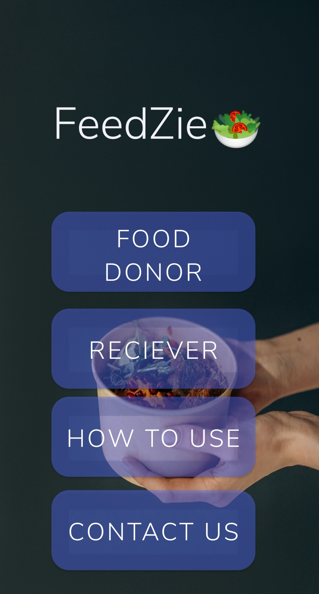
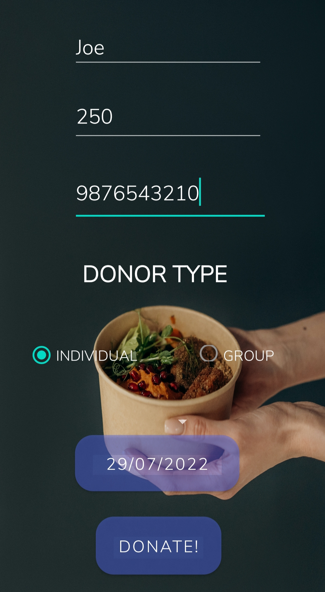
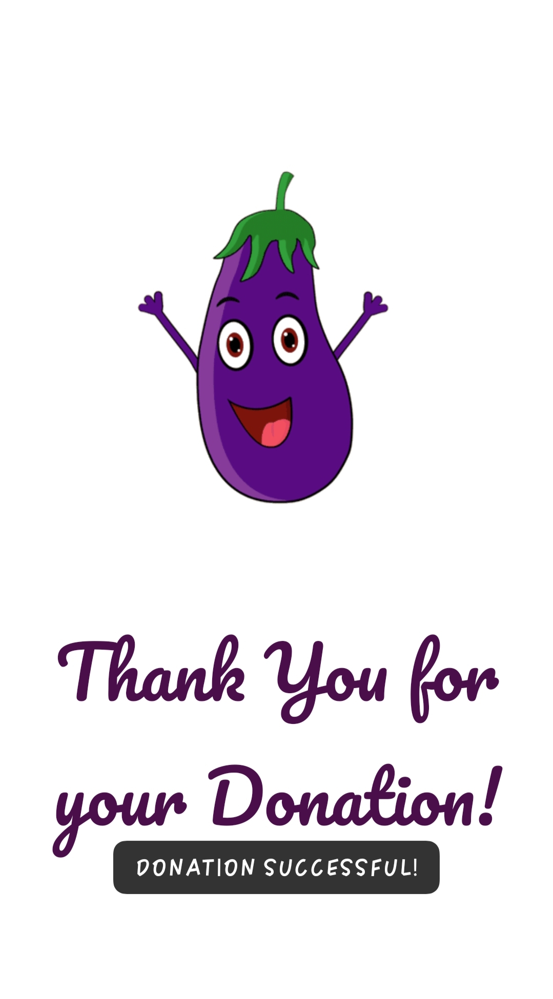
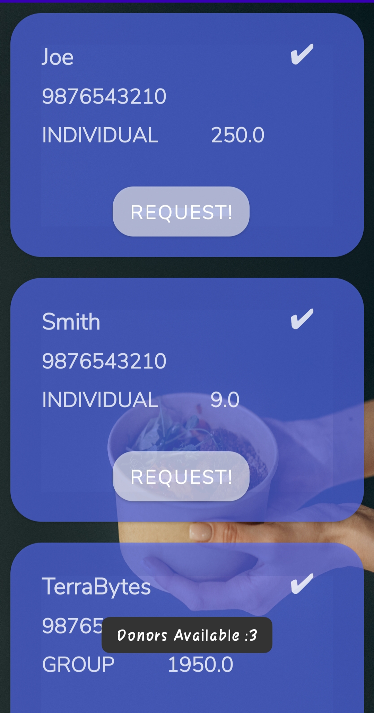
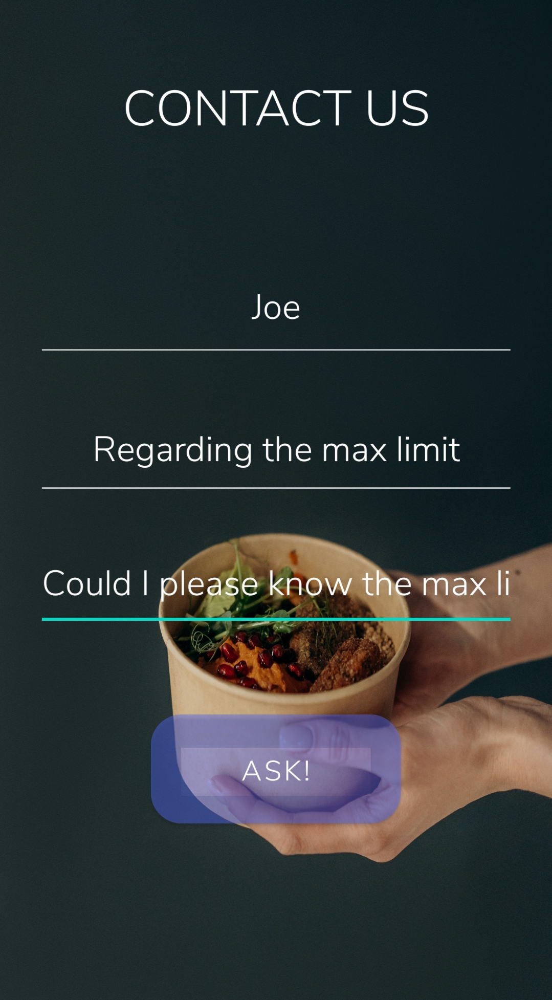
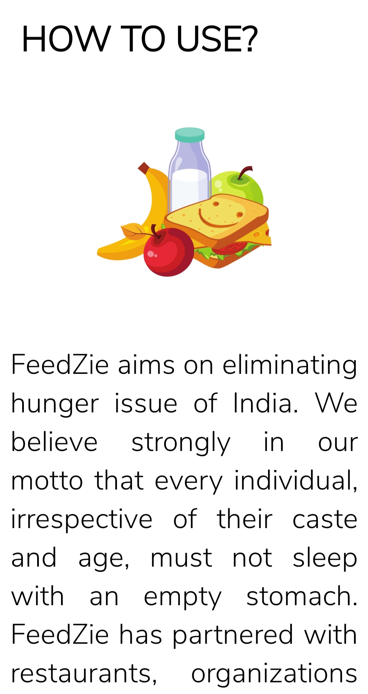

# FeedZie - A Food Donation App

## Introduction

The objective of this application is to develop a system that effectively provides an
interface for the donors who are in search of people to donate surplus food, as a result,
minimizing food wastage and feeding the impoverished and the needy. The application
is targeted in two ways, it benefits the user who is donating the food and the person or
an organization that is claiming the food.

## Specification

  
* Programming Languages : Java, XML 
  
* Database : SQLite

* Platform : Android Studio
* Hardware Specification : i5 Processsor, 8GB RAM, 1TB Hardisk
* Operating System : Windows 10

## Some screenshots of the Application: 

<table>
  <tr>
    <td>Home Screen</td>
    <td>Donate Page</td>
    <td>Successful Donation Screen</td>
    
  </tr>
  <tr>
    <td></td>
    <td></td>
    <td></td>
    
  </tr>
 </table>
 <table>
  <tr>
    <td>Receiver Page</td>
    <td>Contact Us Screen</td>
    <td>Application Guide Screen</td>
  </tr>
  <tr>
    <td></td>
    <td></td>
    <td></td>
  </tr>
 </table>
 </table>
 

